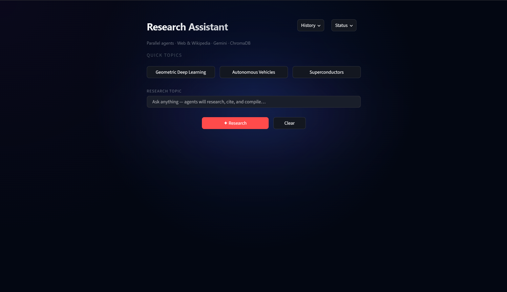
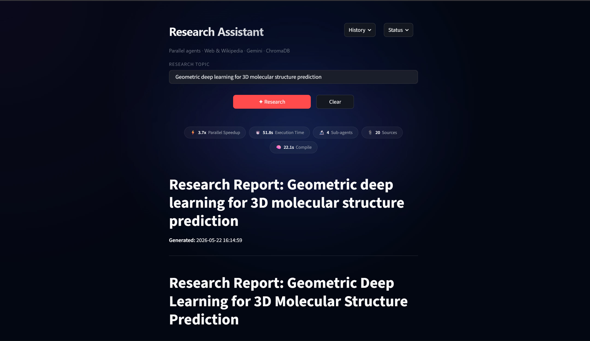
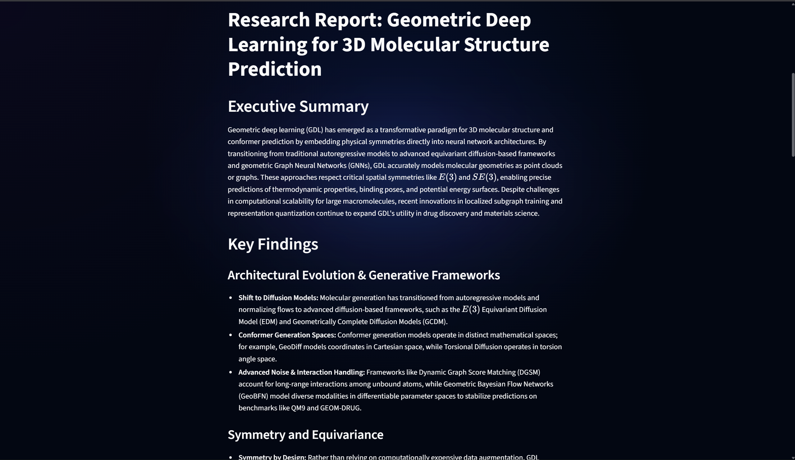
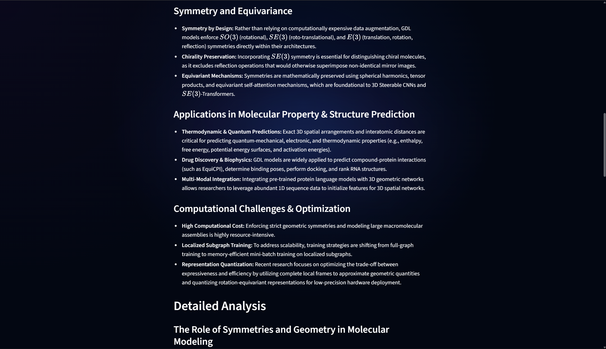
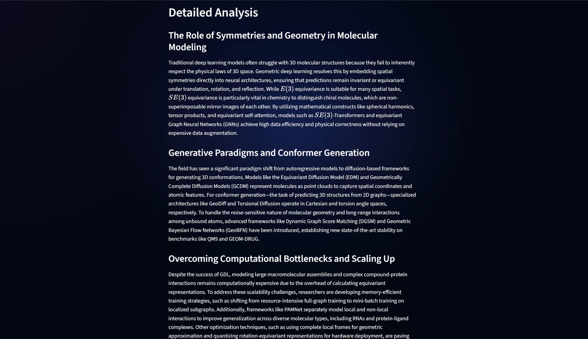
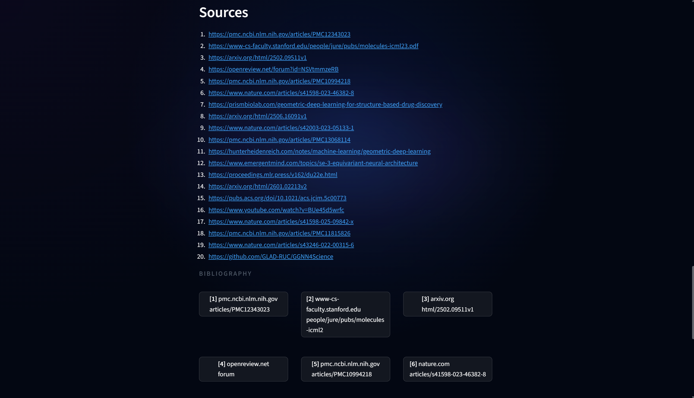
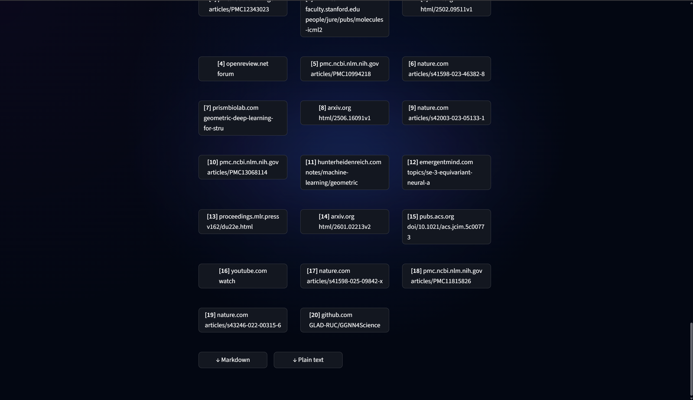
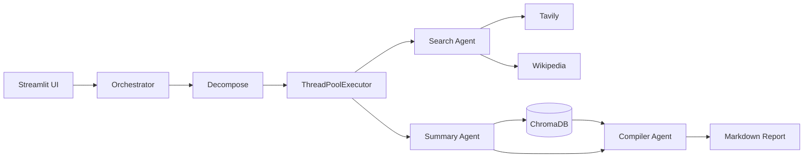

# Multi-Agent Research Assistant

A Streamlit application that turns a single research question into a cited report. The pipeline decomposes the topic, searches the web and Wikipedia in parallel, summarises each thread with a fast model, caches results locally, and compiles a structured markdown document with a higher-quality model. LangSmith traces every LLM call.

## Screenshots

<p align="center">
  <br/><br/>
  <br/><br/>
  <br/><br/>
  <br/><br/>
  <br/><br/>
  <br/><br/>
  
</p>

## What it does

1. **Decompose** — The topic is split into three to five focused sub-questions.
2. **Search** — Each sub-question is researched via Tavily (web) and Wikipedia in parallel worker threads.
3. **Summarise** — Gemini Flash produces short summaries with source URLs.
4. **Cache** — Summaries are stored in a local ChromaDB collection for repeat topics.
5. **Compile** — Gemini Pro merges summaries into a report with executive summary, findings, analysis, and a deduplicated source list.

The UI shows parallel speedup (wall-clock vs summed task time), a live workflow timeline during runs, and a bibliography grid when the report is ready.

## Architecture



| Component | Role |
|-----------|------|
| `OrchestratorAgent` | Decomposition, parallel dispatch, timing metrics |
| `SearchAgent` | Hybrid Tavily + Wikipedia retrieval |
| `SummaryAgent` | Per sub-question summaries (Flash) |
| `CompilerAgent` | Final report assembly (Pro) |
| `VectorStore` | Persistent summary cache |
| `app.py` | Streamlit front end |

## Tech stack

- Python 3.10+
- [LangChain](https://www.langchain.com/) + `langchain-google-genai`
- [Google Gemini](https://ai.google.dev/) (Flash for decomposition/summaries, Pro for compilation)
- [Tavily](https://tavily.com/) via `langchain-tavily`
- [Wikipedia](https://www.wikipedia.org/) via `wikipedia-api`
- [ChromaDB](https://www.trychroma.com/) (local persistent store)
- [LangSmith](https://smith.langchain.com/) (tracing)
- [Streamlit](https://streamlit.io/)

## Prerequisites

- Python 3.10 or newer
- API keys: [Google AI Studio](https://aistudio.google.com/apikey), [Tavily](https://app.tavily.com/), optional [LangSmith](https://smith.langchain.com/)

## Setup

```bash
git clone https://github.com/Arnav-Tyagii/Multi-Agent-Research.git
cd Multi-Agent-Research

python -m venv .venv
# Windows
.venv\Scripts\activate
# macOS / Linux
source .venv/bin/activate

pip install -r requirements.txt
cp .env.example .env
```

Edit `.env` and set your keys:

| Variable | Required | Description |
|----------|----------|-------------|
| `GOOGLE_API_KEY` | Yes | Gemini API key |
| `TAVILY_API_KEY` | Yes | Tavily search API key |
| `LANGSMITH_API_KEY` | No | Enables LangSmith tracing |
| `LANGCHAIN_TRACING_V2` | No | Set to `true` with LangSmith |
| `LANGCHAIN_PROJECT` | No | Defaults to `multi-agent-research` |

## Run

```bash
streamlit run app.py
```

Open `http://localhost:8501`, enter a topic, and run **Research**. Use **History** for past reports and **Status** to confirm API connectivity.

## Configuration

Edit `config.py` to tune behaviour:

| Constant | Default | Purpose |
|----------|---------|---------|
| `FLASH_MODEL` | `gemini-3.5-flash` | Decomposition and summarisation |
| `PRO_MODEL` | `gemini-3.5-flash` | Final report (use a Pro-tier model for best quality) |
| `MAX_SEARCH_RESULTS` | `5` | Tavily results per query |
| `MAX_WORKERS` | `5` | Parallel sub-question threads |
| `CHROMA_PERSIST_DIR` | `./chroma_db` | Vector store path |

## Project layout

```
multi_agent_research/
├── app.py                 # Streamlit UI
├── config.py              # Environment and constants
├── requirements.txt
├── agents/
│   ├── orchestrator.py    # Pipeline coordinator
│   ├── search_agent.py    # Tavily + Wikipedia
│   ├── summary_agent.py
│   └── compiler_agent.py
├── memory/
│   └── vector_store.py    # ChromaDB cache
└── utils/
    ├── prompt_templates.py
    ├── report_builder.py
    └── llm_content.py
```

## Observability

With LangSmith configured, each run appears under the project named in `LANGCHAIN_PROJECT`. Traces include decomposition, parallel summary calls, and compilation with latency and token usage.

Dashboard: `https://smith.langchain.com/o/default/projects/p/multi-agent-research`

## Repository

https://github.com/Arnav-Tyagii/Multi-Agent-Research

## Notes

- `chroma_db/` is created at runtime and is gitignored.
- Re-running the same topic may hit the cache when three or more summaries already exist for that exact topic string.
- Parallel speedup in the UI is estimated as the sum of per-task durations divided by parallel wall-clock time (no second sequential run).

## License

MIT — see [LICENSE](LICENSE).
